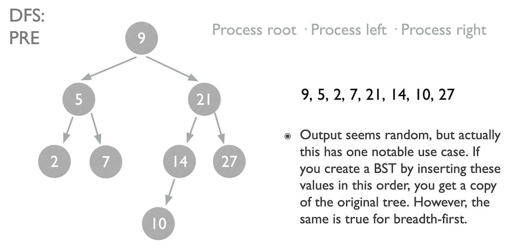

# Day 27: Data Structures

**You should be able to:**
- Define and distinguish Abstract Data Types (ADT) and Data Structures (DS)
- Describe how both a stack and a queue work (how are they different, what similarities do they have, etc.)
- Implement a Linked List and Binary Search Tree (BST) class
- Explain the high-level differences between depth-first and breadth-first search
- Explain the differences between pre-order, in-order, and post-order processing

## Choose whether a given object is an ADT or a DS:

|   | ADT | DS |
| - | --- | -- |
| Contiguous Array |   | ☑️ |
| Stack | ☑️ |   |
| Queue | ☑️ |   |
| List | ☑️ |   |
| Tree | ☑️ |   |
| Linked List |   | ☑️ |

**Overview:**
- **Abstract Data Type (ADT)** – It's a blueprint of expected operations and how information is related.
- **Data Structure (DS)** – It's an actual implementation of how information is stored memory.

## Match the method with the appropriate ADT:

|   | Stack | Queue |
| - | ----- | ----- |
| Enqueue |   | ☑️ |
| Dequeue |   | ☑️ |
| Push | ☑️ |  |
| Pop | ☑️ |   |

## Choose which type of tree traversal is better for the given task:

|   | Breadth First Search | Depth First Search |
| - | -------------------- | ------------------ |
| Traverses tree level by level | ☑️ |   |
| Traverses tree branch by branch |   | ☑️ |
| Good for copying a BST | ☑️ | ☑️ (pre-order) |

**Reference:**
- [BFS to copy a graph](https://leetdev.io/programming-interview-study-guide/learn-breadth-first-search-graph-traversal-with-clone-graph)
- 

## Match each use case with the appropriate depth first traversal methods:

|   | Pre-order   (root, left, right) | Post-order   (left, right, root) | In-order   (left, root, right) |
| - | - | - | - |
| Produces a sorted list of items from a BST |   |   | ☑️ |
| Remove all tree nodes from memory |   | ☑️ |   |
| Clone a binary search tree | ☑️ |   |   |
